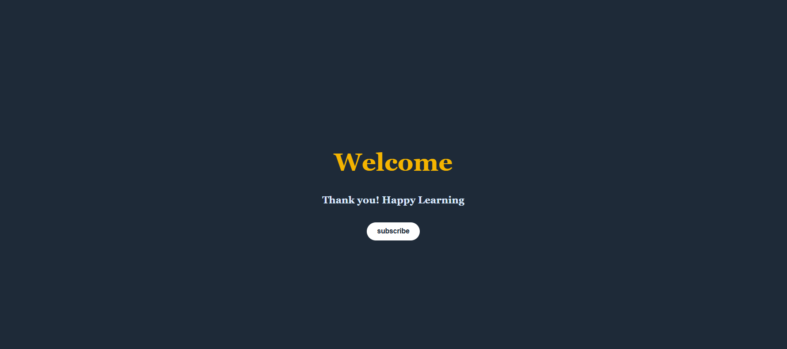

# Welcome App

A simple and elegant React application that toggles between **Subscribe** and **Subscribed** states. Perfect for learning how `useState` works in React with a clean UI and button toggle functionality.

---

## Features

- Toggle subscription state using `useState`

---

## Tech Stack

- **Frontend:** React

---

## Preview

---

